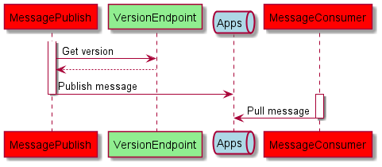

# CI / CD

**C**ontinuous **I**ntegration and **C**ontinuous **D**eployment/**D**elivery is about integrating and automate build, test and deployment into development.

We will dive into CI when creating pipelines which builds project and triggering on changes.

We will dive into Github Actions, https://github.com/features/actions, but the principles are the same when using Azure- or Bitbucket pipelines.

We will dive into CD, when we deploy Argo CD into a Kubernetes cluster, and from Argo UI specify which deployments from Github repository branches we want to deploy to the cluster.

## CI - Github actions

Clone this repository and go to folder `CICD`. Checkout branch develop.

There are some workflows already defined. The exercise it to
- Create a pipeline which triggers on all code changes in the `application` sub directory. The pipeline should
    - Restore
    - Build
- Create a pipeline which runs the DotnetBenchmark in the directory `application/BenchRepo`. The pipeline should
    - Restore
    - Build
    - Run benchmark

See https://github.com/actions/setup-dotnet

## CD - Argo CD

You need a Kubernetes cluster either in WSL2 or minikube. Also you need to create a acount on Docker Hub where you can push docker images.

- First setup Argo by following the instructions in below section **Setup Argo**. 
- Change the version returned by the application `application/VersionEndpoint`.
- Add username and passwords as secrets Github, https://docs.github.com/en/actions/security-guides/encrypted-secrets
- Run the workflow `docker-version` - update environment variable `TAG`.
- Change `repository` and `tag` in `application/chart-version/values.yaml` to point to your Docker Hub repository
- Push changes
- Sync the deployment **chart-version** from the Argo UI
- Navigate to Kowl at `localhost:8090` and validate the publisher are not publishing message with a new version to topic `apps`.

## Component overview



**MessagePublish** gets version from REST endpoint on application **VersionEndpoint**.

**MessagePublish** then publish message to topic *apps*.

**MessageConsumer** poll message from topic *apps* and write message to console.

## Setup Argo

```
helm dependency update ./infrastructure/
helm upgrade --install infrastructure ./infrastructure
```

### Setup continous deployment in Argo UI
 
 Follow instructions in below link, which describe how to use Argo UI, to deploy middleware, message and version deployments.

 https://argo-cd.readthedocs.io/en/stable/getting_started/#creating-apps-via-ui

Use **admin** for both username and password to access the UI.

Deploy **Version** before **Message** since **Message** rely on a endpoint from the **Version** deployment.

#### Config

| Release/Config | Application Name | Repository URL                             | Path                      | Namespace |
|----------------|------------------|--------------------------------------------|---------------------------|-----------|
| Middleware     | middleware       | https://github.com/3schwartz/StudyGroup.git | CICD/middleware                | default   |
| Version        | chart-version    | https://github.com/3schwartz/StudyGroup.git | CICD/application/chart-version | default   |
| Message        | chart-message    | https://github.com/3schwartz/StudyGroup.git | CICD/application/chart-message | default   |


## References
- https://argo-cd.readthedocs.io/en/stable/
- https://github.com/argoproj/argocd-example-apps